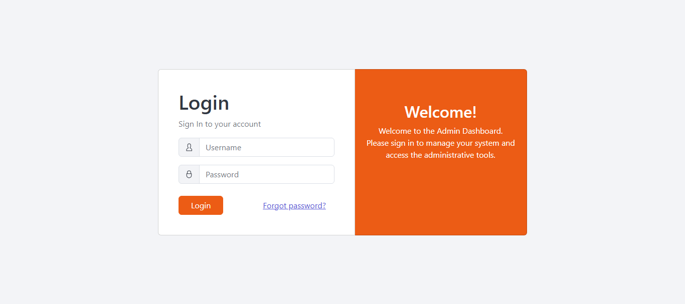
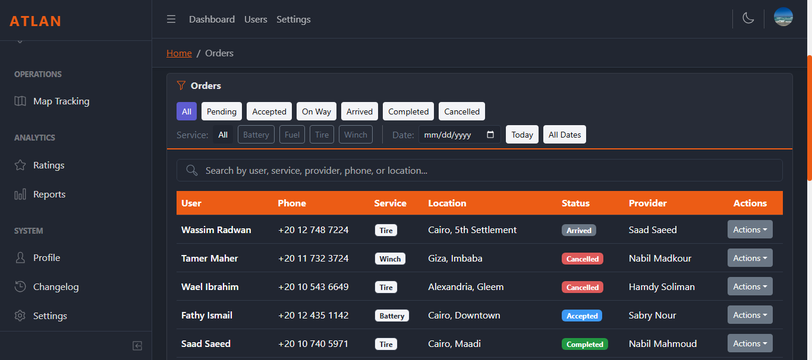
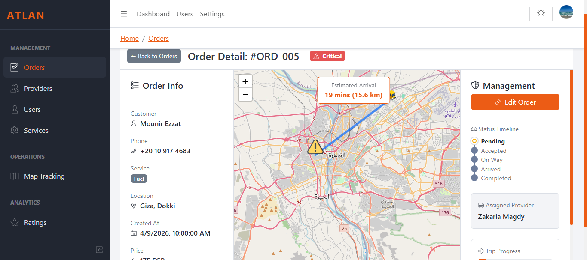
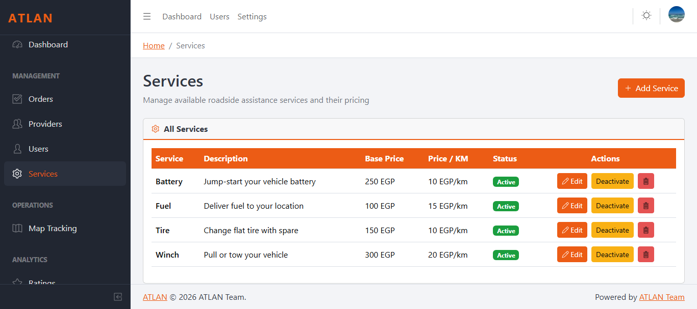
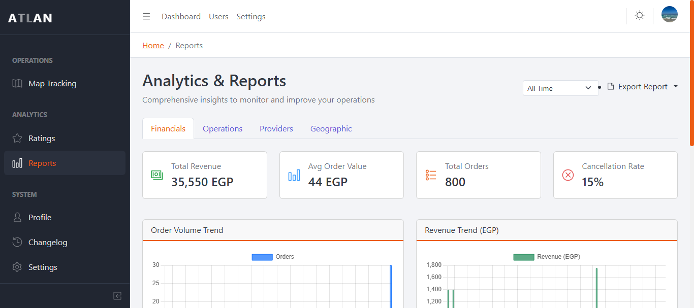

# Roadside Assistance Dashboard

A professional admin control center for managing an on-demand roadside assistance platform. This dashboard allows administrators to monitor system activity, manage users and providers, track active service requests in real-time, and analyze system performance.

## Features

- **System Monitoring**: Real-time overview of total users, providers, and active orders.
- **Order Management**: Full lifecycle tracking of service requests from pending to completed.
- **Real-time Map Tracking**: Visual monitoring of user and provider locations with active order markers.
- **User & Provider Management**: Comprehensive tools to manage profiles, verify providers, and monitor ratings.
- **Service Configuration**: Dynamic management of available roadside services and pricing.
- **Analytics & Reports**: Data-driven insights into revenue, service distribution, and provider performance.

## Tech Stack

- **Frontend**: React
- **UI Framework**: CoreUI / Bootstrap
- **Styling**: SCSS
- **Icons**: CoreUI Icons

## Installation

```bash
# Clone the repository

# Navigate to the project directory
cd .\atlan-admin-dashboard\

# Install dependencies
npm install

# Start the development server
npm start
```
### Screenshot Gallery







---

## System Design & Implementation Plan

### 1. System Context

The platform connects three main actors:

- **User**: Car owner requesting service.
- **Provider**: Mechanic or tow truck operator.
- **Admin**: Manager using this dashboard.

**Service Flow**:
`User Request` $\rightarrow$ `System Matches Provider` $\rightarrow$ `Provider Accepts` $\rightarrow$ `Service Delivery` $\rightarrow$ `User Rating`.

### 2. Dashboard Core Modules

- **Dashboard Main**: Top statistics cards, order charts, and recent activities.
- **Orders**: Table with filters (Pending, Accepted, In Progress, Completed, Cancelled) and admin actions.
- **Providers**: Management of availability, company details, and service history.
- **Users**: User profiles and order history tracking.
- **Services**: Configuration of service types (Mechanical, Tire Repair, Battery, Fuel, Towing).
- **Map Tracking**: Real-time visualization of users (blue), providers (green), and active orders (red).
- **Ratings**: Quality monitoring via user feedback and provider ratings.
- **Reports**: Revenue and performance analytics.

### 3. UI/UX Specifications

- **Primary Theme**: Blue (`#0d6efd`) and Dark Gray (`#212529`).
- **Status Indicators**:
  - Pending $\rightarrow$ Orange
  - Accepted $\rightarrow$ Blue
  - In Way $\rightarrow$ Purple
  - arrived $\rightarrow$ Green
  - Completed $\rightarrow$ Red

- **Professional Enhancements**: Loading skeletons, status badges.

### 4. Project Structure

- `src/_nav.js`: Sidebar navigation configuration.
- `src/routes.js`: Application routing.
- `src/views/`: Page implementations.
- `src/components/`: Reusable UI components.
